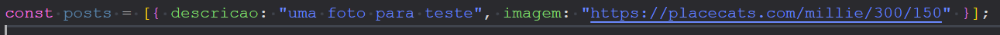

# imersao-alura-backend-gemini
Imersão Alura Google Gemini 18/11 a 22/11

## Aula 01: Desvendando APIs e Servidores
1. Instalar o node.js
2. Começando o projeto
   1. npm init es6 -y, vai criar o package.json
   2. Utilizar o git bash ou comand prompt, não utilizar o powershell
   3. Pesquisar o que é o npm?
   4. Pesquisar o que é package.json?
   5. npm install express, vai instalar 65 packages e criar a pasta node-modules
   6. Pesquisar o que é package-lock.json?
   7. Pesquisar o que é node-modules?
   8. Criar um arquivo server.js
   9. Requisição e Resposta?

## Aula 02: Criando e Estruturando sua primeira API com GET e Banco de dados (DB)

1. O que são http status?
   1. https://http.cat/
2. Baseado na imagem abaixo, crie novos posts para um mock. 
3. Adicione um ID em cada objeto
4. Instalar no drive do mongodb
   1. npm install mongodb

## Aula 03: Conectando sua API ao MongoDB: Estrutura, Conexão e Refatoração

1. npm install mongodb
2. Proteger dados sensíveis (Senhas, Chaves API), criar o arquivo .env
3. No package.json, na parte script no dev = node --watch --env-file=.env server.js
   1. Estou estudando javascript e gostaria de entender para que servem as instruções async e await em um código. Explique em uma frase o que instrução faz?
4. Pedir para o Gemini criar comentários para cada função

## Aula 04: Implementando Armazenamento e Upload de Imagens

1. Testar novamente pq não está voltando o post com o id